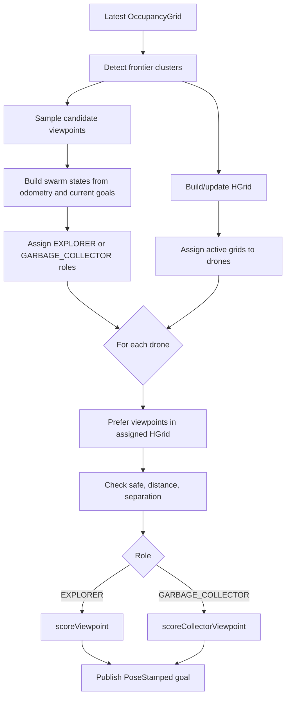
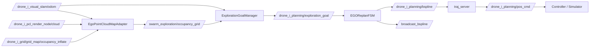
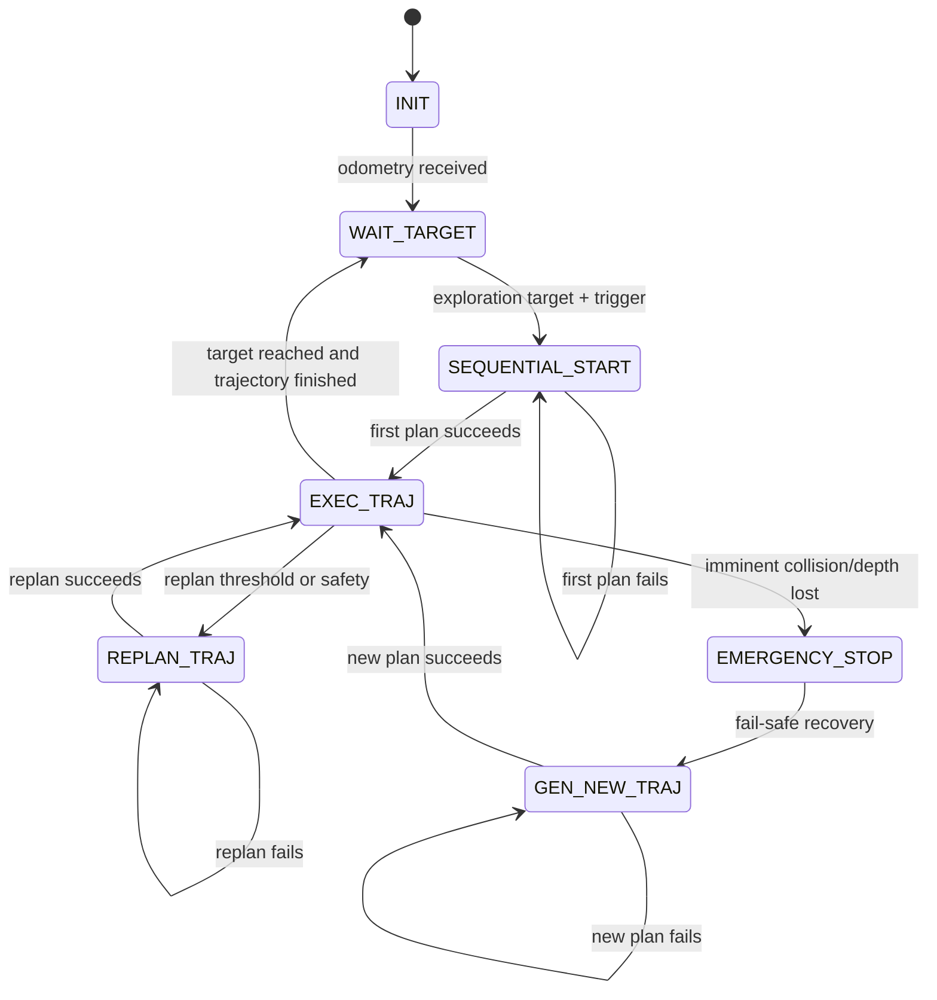

# frontier_hgrid_role Code Breakdown

This document summarizes the `frontier_hgrid_role` mode for the ROS2 Humble UAV exploration stack launched with:

```bash
ros2 launch ego_planner swarm.launch.py exploration_mode:=frontier_hgrid_role use_rviz:=true
```

The explanation is based on the source code under `/root/catkin_ws/src`. Where behavior is not visible in code, it is marked as unclear from code.

## 1. Launch Entry Point

Main launch file:

- `/root/catkin_ws/src/planner/plan_manage/launch/swarm.launch.py`

The launch argument `exploration_mode` is declared with four choices:

| Mode | Separation | HGrid | Role Assignment |
|---|---:|---:|---:|
| `frontier` | false | false | false |
| `frontier_separation` | true | false | false |
| `frontier_hgrid` | true | true | false |
| `frontier_hgrid_role` | true | true | true |

Source evidence:

- `swarm.launch.py`: `DeclareLaunchArgument('exploration_mode', choices=[...])`
- `swarm.launch.py`: `enable_multi_drone_separation`
- `swarm.launch.py`: `enable_hgrid`
- `swarm.launch.py`: `enable_role_assignment`

For `frontier_hgrid_role`, these booleans are passed into:

- `/root/catkin_ws/src/exploration_swarm/launch/swarm_exploration_fame_ros2.launch.py`
- node: package `exploration_swarm`, executable `swarm_exploration_node`

## 2. Nodes Launched

`swarm.launch.py` launches these major parts:

| Block | Node / Include | Source |
|---|---|---|
| Map generator | `map_generator/random_forest` or `mockamap/mockamap_node` | `swarm.launch.py` |
| Drone 0..3 stack | includes `ego_planner/launch/run_in_sim.launch.py` | `swarm.launch.py` |
| Exploration manager | includes `exploration_swarm/launch/swarm_exploration_fame_ros2.launch.py` | `swarm.launch.py` |
| RViz | `rviz2`, config `ego_planner/launch/exp.rviz` | `swarm.launch.py` |
| Evaluation, optional | includes `eval/launch/exploration_time_evaluation.launch.py` | `swarm.launch.py` |

The default drone list in `swarm.launch.py` contains four UAVs:

- drone 0: `/drone_0_*`
- drone 1: `/drone_1_*`
- drone 2: `/drone_2_*`
- drone 3: `/drone_3_*`

Each drone includes `run_in_sim.launch.py` with `flight_type='5'`. In the EGO FSM header, `TARGET_TYPE::EXPLORATION_TARGET = 5`, so this connects EGO-Planner to exploration goals.

Source evidence:

- `/root/catkin_ws/src/planner/plan_manage/launch/run_in_sim.launch.py`
- `/root/catkin_ws/src/planner/plan_manage/include/ego_planner/ego_replan_fsm.h`
- `/root/catkin_ws/src/planner/plan_manage/src/ego_replan_fsm.cpp`

## 3. Mode Difference Summary

`frontier_hgrid_role` is the full ablation mode:

```text
frontier_hgrid_role = frontier detection
                    + multi-drone goal separation
                    + HGrid region allocation
                    + dynamic role assignment
```

Compared with the other modes:

- `frontier`: detects frontiers and assigns viewpoints, but has no explicit goal separation, no HGrid, and no role split.
- `frontier_separation`: adds duplicate-goal avoidance by requiring candidate viewpoints to be separated from already assigned goals.
- `frontier_hgrid`: adds grid-region allocation. Drones first try viewpoints inside assigned grid regions, then fall back to all frontiers.
- `frontier_hgrid_role`: adds dynamic `EXPLORER` / `GARBAGE_COLLECTOR` role assignment and uses role-specific scoring.

Source evidence:

- `ExplorationGoalManager::processLatestMap()`
- `ExplorationGoalManager::updateFrontierGoals()`
- `HGridAllocator::assignGridsToDrones()`
- `RoleAssigner::assignRole()`

## 4. Main Architecture Blocks

### A. UAV / Sensor Input Block

Each drone stack publishes odometry and local map clouds using remapped names from:

- `/root/catkin_ws/src/planner/plan_manage/launch/advanced_param.launch.py`
- `/root/catkin_ws/src/planner/plan_manage/launch/simulator.launch.py`

Important remappings:

| Logical Topic | Resolved Example for Drone 0 |
|---|---|
| `odom_world` | `/drone_0_visual_slam/odom` |
| `grid_map/cloud` | `/drone_0_pcl_render_node/cloud` |
| `grid_map/depth` | `/drone_0_pcl_render_node/depth` |
| `grid_map/pose` | `/drone_0_pcl_render_node/camera_pose` |
| `grid_map/occupancy_inflate` | `/drone_0_grid/grid_map/occupancy_inflate` |

The exploration manager subscribes to odometry through:

- `ExplorationGoalManager::createOdometrySubscriptions()`

With default parameters, it subscribes to:

- `/drone_0_visual_slam/odom`
- `/drone_1_visual_slam/odom`
- `/drone_2_visual_slam/odom`
- `/drone_3_visual_slam/odom`

### B. Mapping Block

There are two mapping layers:

1. EGO-Planner local mapping per drone

- Source: `advanced_param.launch.py`
- Parameters under `grid_map/*`
- Outputs inflated occupancy point cloud per drone:
  - `/drone_i_grid/grid_map/occupancy_inflate`

2. Swarm exploration 2D occupancy adapter

- Class: `EgoPointCloudMapAdapter`
- Source: `/root/catkin_ws/src/exploration_swarm/src/ego_pointcloud_map_adapter.cpp`
- Subscribes to global cloud, per-drone local clouds, per-drone inflated occupancy clouds, and odometry.
- Publishes `nav_msgs/msg/OccupancyGrid` to `/swarm_exploration/occupancy_grid`.

Important functions:

- `EgoPointCloudMapAdapter::start()`
- `EgoPointCloudMapAdapter::initializeGrid()`
- `EgoPointCloudMapAdapter::updateGridFromDroneObservation()`
- `EgoPointCloudMapAdapter::markKnownFreeAroundDrone()`
- `EgoPointCloudMapAdapter::markOccupiedFromLocalCloud()`
- `EgoPointCloudMapAdapter::markOccupiedFromGridCloud()`

Dynamic map update beyond this adapter and EGO local map internals is unclear from code in this summary; inspect `/root/catkin_ws/src/planner/plan_env` for the full local occupancy implementation.

### C. Frontier Detection Block

Class:

- `FrontierDetector`

Files:

- `/root/catkin_ws/src/exploration_swarm/include/exploration_swarm/frontier_detector.hpp`
- `/root/catkin_ws/src/exploration_swarm/src/frontier_detector.cpp`

Main functions:

- `FrontierDetector::detectFrontiers()`
- `FrontierDetector::isFrontierCell()`
- `FrontierDetector::expandFrontierBFS()`
- `FrontierDetector::computeFrontierInfo()`
- `FrontierDetector::downsampleFrontier()`

Logic:

- A frontier cell is a known-free occupancy-grid cell adjacent to at least one unknown cell.
- Connected frontier cells are grouped with BFS.
- Clusters smaller than `frontier.cluster_min` are dropped.
- Each cluster stores `cells`, `filtered_cells`, `average`, `box_min`, `box_max`, and `label`.

Data structure:

- `FrontierCluster` in `/root/catkin_ws/src/exploration_swarm/include/exploration_swarm/exploration_common.hpp`

### D. HGrid Block

Class:

- `HGridAllocator`

Files:

- `/root/catkin_ws/src/exploration_swarm/include/exploration_swarm/hgrid_allocator.hpp`
- `/root/catkin_ws/src/exploration_swarm/src/hgrid_allocator.cpp`

Important functions:

- `HGridAllocator::setMap()`
- `HGridAllocator::update()`
- `HGridAllocator::buildGrid()`
- `HGridAllocator::countGridInformation()`
- `HGridAllocator::assignGridsToDrones()`
- `HGridAllocator::getFrontiersInAssignedGrids()`

What HGrid means in this code:

- It is a coarse 2D grid over the `nav_msgs/msg/OccupancyGrid`.
- Each `GridCellInfo` stores `unknown_num`, `frontier_num`, `free_num`, `active`, and contained frontier IDs.
- Active grids are assigned to drones based on distance plus consistency cost.

Important caveat:

- Although `GridCellInfo` has a `level` field, `HGridAllocator::buildGrid()` sets every grid to `level = 0`. No multi-level hierarchy is implemented in the current code. So the current HGrid behaves as a coarse region allocator, not a true multi-resolution hierarchy.

### E. Role Assignment / Swarm Coordination Block

Class:

- `RoleAssigner`

Files:

- `/root/catkin_ws/src/exploration_swarm/include/exploration_swarm/role_assigner.hpp`
- `/root/catkin_ws/src/exploration_swarm/src/role_assigner.cpp`

Roles:

- `EXPLORER`
- `GARBAGE_COLLECTOR`
- `UNKNOWN`

Main functions:

- `RoleAssigner::assignRole()`
- `RoleAssigner::assignRoleFromNearbyFrontiers()`

Role logic:

- If `role_assigner.fixed` is true, the role is forced by `role_assigner.fix_role`.
- Otherwise, nearby frontiers within `role_assigner.region_size` are counted.
- Small frontier clusters are counted as islands using `role_assigner.cluster_xy_size`.
- `FrontierLabel::TRAIL` clusters are counted as trails.
- If a nearby drone is already `GARBAGE_COLLECTOR`, the current drone becomes `EXPLORER`.
- If nearby frontier structure is sufficient, the drone becomes `EXPLORER`; otherwise it becomes `GARBAGE_COLLECTOR`.

Swarm coordination in this exploration node is centralized inside `swarm_exploration_node`: it reads all drone odometry, computes all goals, and publishes one goal per drone. Inter-UAV trajectory collision checking is handled separately inside EGO-Planner using B-spline trajectory broadcast/subscription.

### F. Target Decision Block

Class:

- `ExplorationGoalManager`

File:

- `/root/catkin_ws/src/exploration_swarm/src/exploration_goal_manager.cpp`

Main flow:

- `processLatestMap()`
- `updateFrontierGoals()`
- `scoreViewpoint()`
- `scoreCollectorViewpoint()`
- `viewpointToGoal()`

Candidate viewpoints are generated by:

- `ViewpointSampler::sampleViewpoints()`
- `/root/catkin_ws/src/exploration_swarm/src/viewpoint_sampler.cpp`

Viewpoint sampling checks:

- candidate radius around frontier cluster
- map bounds
- free occupancy cell
- minimum obstacle clearance
- field-of-view angles
- line of sight
- minimum visible frontier cells

Selection checks in `ExplorationGoalManager::updateFrontierGoals()`:

- odometry exists
- current goal reached or timed out before republishing if `publish_only_when_reached`
- candidate is safe
- candidate distance is between `min_goal_distance` and `max_goal_distance`
- candidate is separated from already assigned goals when separation is enabled
- candidate belongs to assigned HGrid when HGrid is enabled, with fallback to all frontiers
- scoring uses `scoreCollectorViewpoint()` for `GARBAGE_COLLECTOR`, otherwise `scoreViewpoint()`

## 4.5 Methodology and Equations Implemented in Code

This section writes the implemented method as equations. These are not new equations invented for a paper; they are direct mathematical forms of the code in:

- `/root/catkin_ws/src/exploration_swarm/src/frontier_detector.cpp`
- `/root/catkin_ws/src/exploration_swarm/src/viewpoint_sampler.cpp`
- `/root/catkin_ws/src/exploration_swarm/src/hgrid_allocator.cpp`
- `/root/catkin_ws/src/exploration_swarm/src/role_assigner.cpp`
- `/root/catkin_ws/src/exploration_swarm/src/exploration_goal_manager.cpp`

### 4.5.1 Problem Formulation

At each timer update, the swarm exploration node solves a constrained, greedy multi-UAV target assignment problem over frontier viewpoints.

Let:

- `D = {0, ..., N-1}` be the drone set, where `N = drone_num`.
- `M` be the current 2D occupancy grid from `/swarm_exploration/occupancy_grid`.
- `F = {f_1, ..., f_m}` be detected frontier clusters.
- `V = {v_1, ..., v_k}` be candidate viewpoints sampled around all frontier clusters.
- `p_i` be the current position of drone `i`.
- `g_i` be the selected exploration goal for drone `i`.
- `r_i` be the assigned role of drone `i`, either `EXPLORER` or `GARBAGE_COLLECTOR`.
- `A_i` be the HGrid region assignment for drone `i`.

The implemented decision can be written as:

```text
g_i = argmin_{v in V_i_valid} J_{r_i}(i, v)
```

where `V_i_valid` is the candidate set after applying safety, distance, separation, and HGrid filters. This is solved greedily per drone in `ExplorationGoalManager::updateFrontierGoals()`, not by a global optimizer such as Hungarian assignment, MILP, or gradient optimization.

The output goal is:

```text
g_i = [v.x, v.y, default_goal_z, yaw(v)]
```

implemented by `ExplorationGoalManager::viewpointToGoal()`.

### 4.5.2 Frontier Definition

In `FrontierDetector::isFrontierCell()`, a map cell is a frontier if:

```text
frontier(c) = free(c) AND exists n in N8(c) such that unknown(n)
```

where:

- `free(c)` means `map.data[c] == 0`
- `unknown(c)` means `map.data[c] == -1`
- occupied means `map.data[c] >= 50`
- `N8(c)` is the 8-connected neighborhood

Connected frontier cells are grouped with BFS in `FrontierDetector::expandFrontierBFS()`. A cluster is kept only if:

```text
|f_j.cells| >= frontier.cluster_min
```

The cluster center is:

```text
c_j = (1 / |f_j.cells|) * sum_{x in f_j.cells} x
```

implemented by `FrontierDetector::computeFrontierInfo()`.

### 4.5.3 Candidate Viewpoint Generation

For each frontier cluster center `c_j`, `ViewpointSampler::sampleViewpoints()` samples polar candidates:

```text
v = c_j + rho [cos(phi), sin(phi), 0]
```

where:

```text
rho in [candidate_rmin, candidate_rmax]
phi = 0, candidate_dphi, 2*candidate_dphi, ...
```

A viewpoint is valid only if:

```text
distance_xy(v, c_j) >= frontier.min_candidate_dist
v is inside map
M(v) == free
clearance(v) >= frontier.min_candidate_clearance
visible(v, f_j) >= frontier.min_visib_num
```

Visibility is counted in `ViewpointSampler::countVisibleCells()`:

```text
visible(v, f_j) = sum_{x in f_j.cells} I[
  ||x - v|| <= perception.max_dist
  AND yaw_error(x, v) within camera FOV
  AND line_of_sight(v, x)
]
```

The candidate yaw is aimed at the frontier center:

```text
yaw(v) = atan2(c_j.y - v.y, c_j.x - v.x)
```

### 4.5.4 HGrid Distribution / Region Allocation

When `enable_hgrid = true`, the map is partitioned into square grid regions in `HGridAllocator::buildGrid()`:

```text
grid_size = partitioning.grid_size
G = {q_1, ..., q_s}
```

Each grid `q` stores:

```text
unknown_num(q)
frontier_num(q)
free_num(q)
contained_frontier_ids(q)
```

computed by `HGridAllocator::countGridInformation()`.

A grid is active if:

```text
active(q) =
  unknown_num(q) >= partitioning.min_unknown
  OR frontier_num(q) >= partitioning.min_frontier
  OR free_num(q) >= partitioning.min_free
```

The HGrid assignment cost from drone `i` to grid `q` is implemented in `HGridAllocator::costDroneToGrid()`:

```text
C_grid(i, q) = ||p_i - center(q)|| + C_consistency(i, q)
               - w_unknown * unknown_num(q)
```

where:

```text
C_consistency(i, q) =
  0                                      if previous_grid_id_i < 0
  partitioning.consistent_cost           if q.id == previous_grid_id_i
  partitioning.consistent_cost2          otherwise
```

With launch defaults:

```text
partitioning.consistent_cost  = -5.0
partitioning.consistent_cost2 = 8.0
partitioning.w_unknown        = 0.0
```

So in the current launch configuration, unknown count does not affect HGrid assignment because `w_unknown = 0.0`. Assignment is mainly distance plus a bias to keep the previous grid and penalize switching.

The distribution method is greedy:

1. Sort active grids by high `frontier_num`, then high `unknown_num`, then low grid ID.
2. First pass: each drone gets its lowest-cost unassigned grid.
3. Second pass: remaining active grids are assigned to their lowest-cost drone.

This is not a global minimum-cost matching implementation. It is a greedy region distribution method in `HGridAllocator::assignGridsToDrones()`.

### 4.5.5 Role Assignment Rule

When `enable_role_assignment = true`, role assignment is performed by `RoleAssigner::assignRoleFromNearbyFrontiers()`.

For drone `i`, count frontiers within a local radius:

```text
nearby_frontiers_i = |{f in F : ||center(f) - p_i||_xy <= role_assigner.region_size}|
```

A nearby frontier is counted as an island if:

```text
max(f.box_max.x - f.box_min.x, f.box_max.y - f.box_min.y)
  <= role_assigner.cluster_xy_size
```

Trails are counted if:

```text
f.label == FrontierLabel::TRAIL
```

The implemented role rule is:

```text
if another GARBAGE_COLLECTOR is within role_assigner.region_size:
    r_i = EXPLORER
else if nearby_frontiers_i >= min_num_neighbours
        AND nearby_islands_i < min_num_islands
        AND nearby_trails_i <= min_num_trails:
    r_i = EXPLORER
else:
    r_i = GARBAGE_COLLECTOR
```

With launch defaults:

```text
region_size        = 8.0
cluster_xy_size    = 3.0
min_num_neighbours = 3
min_num_islands    = 4
min_num_trails     = 1
```

Important code caveat:

- `FrontierDetector::detectFrontiers()` currently initializes detected clusters with `FrontierLabel::FRONTIER`.
- I did not find code that assigns `FrontierLabel::TRAIL` in the current exploration path.
- Therefore `nearby_trails` likely remains `0` unless labels are set elsewhere at runtime; this is unclear from code.

### 4.5.6 Valid Candidate Set for Each Drone

For each drone, `ExplorationGoalManager::updateFrontierGoals()` builds a valid candidate set.

A candidate viewpoint `v` must satisfy:

```text
v is safe
min_goal_distance <= ||v - p_i|| <= max_goal_distance
```

If separation is enabled:

```text
||v - g_j|| >= min_goal_separation
```

for goals already assigned to other drones or retained from previous cycles. This is checked by `ExplorationGoalManager::isSeparatedFromAssignedGoals()`.

If HGrid is enabled, the first selection pass restricts candidates to:

```text
v.frontier_id in frontiers(A_i) OR v inside assigned grid A_i
```

implemented by:

- `HGridAllocator::getFrontiersInAssignedGrids()`
- `ExplorationGoalManager::isViewpointInAssignedHGrid()`

If no valid candidate exists inside the assigned HGrid, the code falls back to all frontiers.

### 4.5.7 Explorer Objective Function

For `Role::EXPLORER`, the score minimized by the code is `ExplorationGoalManager::scoreViewpoint()`.

Definitions:

```text
d_i(v) = ||v - p_i||
theta_i(v) = |normalize(yaw(v) - yaw_i)| / explorer.max_ang_dist
```

Previous-goal penalty:

```text
P_prev(i, v) =
  1, if drone i has previous goal and ||v - previous_goal_i|| < min_goal_distance
  0, otherwise
```

Other-drone penalty:

```text
P_other(i, v) =
  sum_{j != i} max(0, dist_collision - ||v - p_j||) / dist_collision
  + sum_{j != i, has_goal_j} max(0, min_goal_separation - ||v - g_j||) / min_goal_separation
  + sum_{g in assigned_goals} max(0, min_goal_separation - ||v - g||) / min_goal_separation
```

Collaboration penalty, when active:

```text
P_collab(i, v) =
  sum_{j != i}
    w_collision * max(0, dist_collision - ||v - p_j||) / dist_collision
  + w_range * max(0, dist_range - ||v - p_j||) / dist_range
```

Information gain proxy:

```text
I(v) = visible_num(v) / max_visible_num
```

Explorer score:

```text
J_explorer(i, v) =
  explorer.w_distance      * d_i(v)
  + explorer.w_direction   * theta_i(v)
  + explorer.w_others      * P_other(i, v)
  + explorer.w_previous_goal * P_prev(i, v)
  + P_collab(i, v)
  - I(v)
```

The selected explorer target is:

```text
g_i = argmin_v J_explorer(i, v)
```

With launch defaults:

```text
explorer.w_distance      = 0.0
explorer.w_direction     = 10.0
explorer.w_others        = 1.0
explorer.w_previous_goal = 1.0
collab_assigner.w_range  = 0.7
collab_assigner.w_collision = 0.3
```

This means distance is not directly penalized for explorers in the current launch because `explorer.w_distance = 0.0`. Direction alignment, separation/collaboration penalties, previous-goal penalty, and visible frontier count dominate.

### 4.5.8 Garbage-Collector Objective Function

For `Role::GARBAGE_COLLECTOR`, the score minimized by the code is `ExplorationGoalManager::scoreCollectorViewpoint()`.

Velocity-scaled distance:

```text
s_i = 1 + collector.velocity_factor * max(0, ||vel_i|| - collector.min_vel)
d_collector(i, v) = ||v - p_i|| / s_i
```

Direction penalty:

```text
theta_i(v) = |normalize(yaw(v) - yaw_i)| / explorer.max_ang_dist
```

Other-drone penalty:

```text
P_other_collector(i, v) =
  sum_{j != i} max(0, collector.min_dist_collision - ||v - p_j||)
              / collector.min_dist_collision
  + sum_{g in assigned_goals} max(0, min_goal_separation - ||v - g||)
                            / min_goal_separation
```

Label / visibility penalty:

```text
P_label(v) = min(1, max(0, visible_num(v)) / max(1, frontier.min_visib_num))
```

Collector score:

```text
J_collector(i, v) =
  collector.w_distance      * d_collector(i, v)
  + collector.w_direction   * theta_i(v)
  + collector.w_others      * P_other_collector(i, v)
  + collector.w_previous_goal * P_prev(i, v)
  + collector.label_penalty * P_label(v)
```

The selected collector target is:

```text
g_i = argmin_v J_collector(i, v)
```

With launch defaults:

```text
collector.w_distance      = 3.0
collector.w_direction     = 1.0
collector.w_others        = 1.0
collector.w_previous_goal = 3.0
collector.label_penalty   = 15.0
collector.velocity_factor = 2.0
collector.min_vel         = 0.7
```

Because `collector.label_penalty` is positive and `P_label` increases with visible frontier cells, the collector is discouraged from choosing high-visible-frontier viewpoints. This makes the collector behave differently from the explorer, which rewards high visible frontier count through `-I(v)`.

### 4.5.9 How the Weights Are Decided in This Code

The code does not implement an automatic weight-learning, optimization, normalization, grid-search, Bayesian tuning, or adaptive update method for the weights.

Weights are selected manually as ROS2 launch parameters in:

- `/root/catkin_ws/src/exploration_swarm/launch/swarm_exploration_fame_ros2.launch.py`

They are read by:

- `ExplorationGoalManager::declareParameters()`
- `ExplorationGoalManager::readParameters()`

Then used directly in:

- `HGridAllocator::costDroneToGrid()`
- `ExplorationGoalManager::scoreViewpoint()`
- `ExplorationGoalManager::scoreCollectorViewpoint()`
- `RoleAssigner::assignRoleFromNearbyFrontiers()` for threshold-style role parameters

So the implemented methodology is:

```text
fixed-weight scalarization + hard constraints + greedy per-drone assignment
```

In paper language, the target selection is a hand-tuned weighted-sum cost function, not a learned policy and not a globally optimal assignment solver.

### 4.5.10 Full Per-Cycle Decision Algorithm

The implemented `frontier_hgrid_role` cycle can be summarized as:

```text
Input:
  Occupancy grid M
  Drone states {p_i, vel_i, yaw_i}
  Previous goals and previous HGrid IDs

1. Detect frontier clusters F from M.
2. Sample viewpoints V around each frontier cluster.
3. Build HGrid cells G from M.
4. Mark active cells using unknown/frontier/free thresholds.
5. Assign active HGrid cells to drones with greedy cost C_grid.
6. For each drone i:
     assign role r_i using local frontier statistics.
7. For each drone i:
     form valid candidate set V_i_valid using:
       safety, distance, separation, and preferred HGrid membership.
     if r_i == EXPLORER:
       choose argmin J_explorer(i, v)
     else:
       choose argmin J_collector(i, v)
8. Publish PoseStamped goal g_i to /drone_i_planning/exploration_goal.
```

### G. EGO-Planner Local Trajectory Planning Block

Exploration goals are sent to each EGO planner as `geometry_msgs/msg/PoseStamped`.

Publisher:

- `ExplorationGoalManager::createGoalPublishers()`
- topics:
  - `/drone_0_planning/exploration_goal`
  - `/drone_1_planning/exploration_goal`
  - `/drone_2_planning/exploration_goal`
  - `/drone_3_planning/exploration_goal`

Subscriber:

- `EGOReplanFSM::init()`
- for `TARGET_TYPE::EXPLORATION_TARGET`
- subscribes to `/drone_i_planning/exploration_goal`

Goal callback:

- `EGOReplanFSM::explorationGoalCallback()`
- calls `planNextWaypoint()`

Planner:

- `EGOPlannerManager`
- source: `/root/catkin_ws/src/planner/plan_manage/src/planner_manager.cpp`

Trajectory generation:

- `EGOReplanFSM::planFromGlobalTraj()`
- `EGOReplanFSM::planFromCurrentTraj()`
- `EGOReplanFSM::callReboundReplan()`
- `EGOPlannerManager::reboundReplan()`

Collision / fail-safe:

- `EGOReplanFSM::checkCollisionCallback()`
- checks inflated map occupancy and swarm trajectories
- can transition to `REPLAN_TRAJ` or `EMERGENCY_STOP`

### H. Command Output Block

EGO planner publishes:

- topic: `/drone_i_planning/bspline`
- type: `traj_utils/msg/Bspline`
- source: `EGOReplanFSM::callReboundReplan()`

Trajectory server subscribes:

- source: `/root/catkin_ws/src/planner/plan_manage/src/traj_server.cpp`
- subscribes to remapped `planning/bspline`
- publishes remapped `position_cmd`

Resolved command topic:

- `/drone_i_planning/pos_cmd`

Message type:

- `quadrotor_msgs/msg/PositionCommand`

Consumers:

- dynamic sim: `so3_control` component in `simulator.launch.py`
- non-dynamic sim: `poscmd_2_odom` node in `simulator.launch.py`

### I. RViz Visualization Block

`use_rviz:=true` launches:

- package: `rviz2`
- executable: `rviz2`
- config: `/root/catkin_ws/src/planner/plan_manage/launch/exp.rviz`

Exploration visualizer source:

- `/root/catkin_ws/src/exploration_swarm/src/exploration_visualizer.cpp`

Important visualization topics:

- `/swarm_exploration/frontiers`
- `/swarm_exploration/viewpoints`
- `/swarm_exploration/current_goals`
- `/swarm_exploration/hgrid`
- `/swarm_exploration/roles`
- `/swarm_exploration/explored_area`
- `/swarm_exploration/occupied_area`
- `/swarm_exploration/unknown_area`
- `/swarm_exploration/explored_area_3d`
- `/swarm_exploration/occupied_area_3d`

EGO planner visualization topics are remapped in `advanced_param.launch.py`:

- `/drone_i_plan_vis/goal_point`
- `/drone_i_plan_vis/global_list`
- `/drone_i_plan_vis/init_list`
- `/drone_i_plan_vis/optimal_list`
- `/drone_i_plan_vis/a_star_list`

## 5. Module Table

| Module | Source File | Main Class/Function | Input | Output | Purpose |
|---|---|---|---|---|---|
| Top swarm launch | `planner/plan_manage/launch/swarm.launch.py` | `generate_launch_description()` | launch args | nodes/includes | Starts map, drones, exploration, RViz |
| Exploration launch | `exploration_swarm/launch/swarm_exploration_fame_ros2.launch.py` | `generate_launch_description()` | launch args | `swarm_exploration_node` params | Configures exploration manager |
| Swarm node | `exploration_swarm/src/swarm_exploration_node.cpp` | `SwarmExplorationNode` | ROS node runtime | `ExplorationGoalManager` | Thin wrapper around manager |
| Goal manager | `exploration_swarm/src/exploration_goal_manager.cpp` | `ExplorationGoalManager` | occupancy grid, odometry | per-drone goals, markers | Main exploration coordinator |
| Frontier detection | `exploration_swarm/src/frontier_detector.cpp` | `FrontierDetector::detectFrontiers()` | `OccupancyGrid` | `FrontierCluster` list | Finds frontier clusters |
| Viewpoint sampling | `exploration_swarm/src/viewpoint_sampler.cpp` | `ViewpointSampler::sampleViewpoints()` | frontier clusters, map | candidate viewpoints | Creates safe visible goals |
| HGrid allocation | `exploration_swarm/src/hgrid_allocator.cpp` | `HGridAllocator::assignGridsToDrones()` | map, frontiers, drone positions | grid-to-drone assignment | Region allocation |
| Role assignment | `exploration_swarm/src/role_assigner.cpp` | `RoleAssigner::assignRole()` | drone state, frontiers | role enum | Explorer/collector split |
| Map adapter | `exploration_swarm/src/ego_pointcloud_map_adapter.cpp` | `EgoPointCloudMapAdapter` | EGO clouds, odometry | occupancy grid | Builds swarm-level 2D map |
| Exploration visualization | `exploration_swarm/src/exploration_visualizer.cpp` | `ExplorationVisualizer` | frontiers, viewpoints, grids, roles | MarkerArray topics | RViz markers |
| EGO launch | `planner/plan_manage/launch/run_in_sim.launch.py` | `generate_launch_description()` | drone id, map params | planner, sim, traj server | Starts one drone stack |
| EGO params | `planner/plan_manage/launch/advanced_param.launch.py` | `ego_planner_node` | launch params | planner node config | Planner/map/FSM parameters |
| EGO FSM | `planner/plan_manage/src/ego_replan_fsm.cpp` | `EGOReplanFSM` | odom, exploration goal, maps | B-spline trajectory | Local replanning FSM |
| Planner manager | `planner/plan_manage/src/planner_manager.cpp` | `EGOPlannerManager::reboundReplan()` | start/target state | optimized B-spline | Local trajectory optimization |
| Trajectory server | `planner/plan_manage/src/traj_server.cpp` | `bsplineCallback()`, `cmdCallback()` | B-spline | `PositionCommand` | Converts trajectory to commands |
| Simulator/controller | `planner/plan_manage/launch/simulator.launch.py` | `so3_control`, `poscmd_2_odom` | `PositionCommand` | odom / motor commands | Simulated actuation |

## 6. ROS2 Topic Flow

| Topic | Message Type | Publisher | Subscriber | Purpose | Source Evidence |
|---|---|---|---|---|---|
| `/map_generator/global_cloud` | `sensor_msgs/msg/PointCloud2` | `map_generator/random_forest` | `EgoPointCloudMapAdapter` | global compatibility cloud | `swarm.launch.py`, `ego_pointcloud_map_adapter.cpp` |
| `/drone_i_visual_slam/odom` | `nav_msgs/msg/Odometry` | simulator / odom stack | EGO FSM, map adapter, exploration manager | drone state | `advanced_param.launch.py`, `ExplorationGoalManager::createOdometrySubscriptions()` |
| `/drone_i_pcl_render_node/cloud` | `sensor_msgs/msg/PointCloud2` | per-drone sensing | EGO local map, map adapter | local obstacle cloud | `advanced_param.launch.py`, `EgoPointCloudMapAdapter::start()` |
| `/drone_i_grid/grid_map/occupancy_inflate` | `sensor_msgs/msg/PointCloud2` | EGO grid map | map adapter | inflated occupied cloud | `advanced_param.launch.py`, `EgoPointCloudMapAdapter::start()` |
| `/swarm_exploration/occupancy_grid` | `nav_msgs/msg/OccupancyGrid` | `EgoPointCloudMapAdapter` | `ExplorationGoalManager` | swarm exploration map | `EgoPointCloudMapAdapter::start()`, `ExplorationGoalManager` constructor |
| `/drone_i_planning/exploration_goal` | `geometry_msgs/msg/PoseStamped` | `ExplorationGoalManager` | `EGOReplanFSM` | selected exploration target | `createGoalPublishers()`, `EGOReplanFSM::init()` |
| `/drone_i_planning/bspline` | `traj_utils/msg/Bspline` | EGO FSM | trajectory server | optimized local trajectory | `advanced_param.launch.py`, `callReboundReplan()` |
| `/broadcast_bspline` | `traj_utils/msg/Bspline` | EGO FSM | other EGO FSMs | swarm trajectory sharing | `advanced_param.launch.py`, `BroadcastBsplineCallback()` |
| `/drone_i_planning/swarm_trajs` | `traj_utils/msg/MultiBsplines` | EGO FSM | next drone FSM | sequential swarm startup trajectories | `EGOReplanFSM::init()`, `publishSwarmTrajs()` |
| `/drone_i_planning/pos_cmd` | `quadrotor_msgs/msg/PositionCommand` | trajectory server | `so3_control` or `poscmd_2_odom` | command output | `run_in_sim.launch.py`, `traj_server.cpp`, `simulator.launch.py` |
| `/swarm_exploration/hgrid` | `visualization_msgs/msg/MarkerArray` | exploration visualizer | RViz | HGrid markers | `exploration_visualizer.cpp`, `exp.rviz` |
| `/swarm_exploration/roles` | `visualization_msgs/msg/MarkerArray` | exploration visualizer | RViz | role labels | `exploration_visualizer.cpp` |

## 7. Parameter Breakdown

| Parameter | File | Default / Value in Launch | Used By | Meaning | Effect |
|---|---|---:|---|---|---|
| `exploration_mode` | `swarm.launch.py` | `frontier_hgrid_role` | launch expressions | ablation mode | turns separation/HGrid/role on |
| `drone_num` | `swarm_exploration_fame_ros2.launch.py` | `4` | `ExplorationGoalManager` | number of UAVs | creates 4 odom subs and 4 goal pubs |
| `map_size_x/y/z` | `swarm.launch.py` | `45/20/5` | map generator, EGO, adapter | world dimensions | map bounds |
| `map_source.resolution` | `swarm_exploration_fame_ros2.launch.py` | `0.1` | map adapter | occupancy grid resolution | map/detail cost |
| `sensing_radius` | `swarm_exploration_fame_ros2.launch.py` | `5.0` | map adapter | local known-free radius | explored region expansion |
| `publish_period` | `swarm_exploration_fame_ros2.launch.py` | `0.5` | `ExplorationGoalManager` timer | update period | goal update cadence |
| `min_goal_separation` | `swarm_exploration_fame_ros2.launch.py` | `3.0` | goal manager | minimum goal distance | duplicate-goal suppression |
| `frontier.cluster_min` | `swarm_exploration_fame_ros2.launch.py` | `10` | frontier detector | minimum cluster cells | filters small frontiers |
| `frontier.min_candidate_clearance` | same | `0.41` | viewpoint sampler, goal safety | obstacle clearance | filters unsafe goals |
| `frontier.candidate_rnum` | same | `3` | viewpoint sampler | candidate rings | more/fewer candidate viewpoints |
| `frontier.candidate_rmin/rmax` | same | `1.0/1.5` | viewpoint sampler | sampling radius | camera standoff distance |
| `frontier.min_visib_num` | same | `30` | viewpoint sampler | visible cells threshold | filters weak viewpoints |
| `perception_utils.max_dist` | same | `4.5` | viewpoint sampler | visibility range | information-gain visibility |
| `partitioning.grid_size` | same | `10.0` | HGrid allocator | coarse grid size | HGrid region granularity |
| `partitioning.min_unknown` | same | `4000` | HGrid allocator | active grid threshold | marks useful grid regions |
| `partitioning.min_frontier` | same | `100` | HGrid allocator | active grid threshold | activates frontier-rich grids |
| `partitioning.consistent_cost` | same | `-5.0` | HGrid allocator | previous grid preference | reduces assignment switching |
| `role_assigner.region_size` | same | `8.0` | role assigner | local role-neighborhood size | role decision locality |
| `role_assigner.min_num_neighbours` | same | `3` | role assigner | frontier count threshold | explorer vs collector |
| `collector.label_penalty` | same | `15.0` | collector scoring | penalizes high visible frontier count | collector avoids explorer-type frontier-rich goals |
| `explorer.w_direction` | same | `10.0` | explorer scoring | yaw alignment weight | target preference |
| `manager/max_vel` | `advanced_param.launch.py` | `2.0` | EGO planner | max velocity | trajectory feasibility |
| `manager/max_acc` | `advanced_param.launch.py` | `3.0` | EGO planner | max acceleration | trajectory feasibility |
| `manager/planning_horizon` | `advanced_param.launch.py` | `7.5` | EGO planner | local horizon | local target distance |
| `optimization/swarm_clearance` | `advanced_param.launch.py` | `0.5` | EGO collision checking | inter-drone clearance | trajectory safety |

## 8. Runtime Execution Flow

1. `swarm.launch.py` starts map generation, four drone stacks, `swarm_exploration_node`, and RViz.
2. Each drone stack starts `ego_planner_node`, `traj_server`, and simulator/controller nodes through `run_in_sim.launch.py`.
3. `swarm_exploration_node` constructs `ExplorationGoalManager`.
4. `ExplorationGoalManager` creates per-drone odometry subscribers and per-drone exploration-goal publishers.
5. `EgoPointCloudMapAdapter` subscribes to EGO local clouds, inflated occupancy clouds, and odometry.
6. `EgoPointCloudMapAdapter::updateGridFromDroneObservation()` publishes `/swarm_exploration/occupancy_grid`.
7. `ExplorationGoalManager::onMap()` stores the latest occupancy grid.
8. Timer calls `ExplorationGoalManager::processLatestMap()`.
9. `FrontierDetector::detectFrontiers()` finds frontier clusters.
10. `HGridAllocator::update()` builds coarse grid regions and counts unknown/free/frontier cells.
11. `HGridAllocator::assignGridsToDrones()` assigns active grid cells to drones.
12. `ViewpointSampler::sampleViewpoints()` generates safe visible candidate viewpoints.
13. `ExplorationGoalManager::updateFrontierGoals()` builds swarm states.
14. `RoleAssigner::assignRole()` assigns `EXPLORER` or `GARBAGE_COLLECTOR`.
15. Each drone chooses the best valid viewpoint using assigned HGrid first, separation constraints, and role-specific scoring.
16. `ExplorationGoalManager` publishes `/drone_i_planning/exploration_goal`.
17. `EGOReplanFSM::explorationGoalCallback()` receives the target and calls `planNextWaypoint()`.
18. EGO FSM transitions into planning/execution states and calls `EGOPlannerManager::reboundReplan()`.
19. `EGOReplanFSM::callReboundReplan()` publishes `/drone_i_planning/bspline`.
20. `traj_server` converts the B-spline into `/drone_i_planning/pos_cmd`.
21. Simulator/controller consumes the command and updates odometry.
22. The map updates and the loop repeats.

## 9. State Machine

Exploration manager:

- No explicit FSM class was found in `exploration_swarm`.
- It is timer-driven by `ExplorationGoalManager::onTimer()` / `processLatestMap()`.

EGO-Planner FSM:

- Class: `EGOReplanFSM`
- Files:
  - `/root/catkin_ws/src/planner/plan_manage/include/ego_planner/ego_replan_fsm.h`
  - `/root/catkin_ws/src/planner/plan_manage/src/ego_replan_fsm.cpp`

Actual states:

| State | Meaning | Main Transition Evidence |
|---|---|---|
| `INIT` | waits for odometry | moves to `WAIT_TARGET` when `have_odom_` |
| `WAIT_TARGET` | waits for target and trigger | moves to `SEQUENTIAL_START` when target/trigger are available |
| `SEQUENTIAL_START` | swarm startup planning order | plans first trajectory, then `EXEC_TRAJ` |
| `GEN_NEW_TRAJ` | generate new trajectory from global path | success to `EXEC_TRAJ`, failure repeats |
| `REPLAN_TRAJ` | replan from current trajectory | success to `EXEC_TRAJ`, failure repeats |
| `EXEC_TRAJ` | executes current trajectory | can replan, wait for next target, or continue |
| `EMERGENCY_STOP` | emergency stop trajectory | can return to `GEN_NEW_TRAJ` if fail-safe allows |

Important triggers:

- Odometry: `EGOReplanFSM::odometryCallback()`
- Exploration goal: `EGOReplanFSM::explorationGoalCallback()`
- Safety check: `EGOReplanFSM::checkCollisionCallback()`
- Planning call: `EGOReplanFSM::callReboundReplan()`

When no frontier exists:

- `ExplorationGoalManager::updateFrontierGoals()` logs no valid viewpoint and keeps publishing current-goal visualization if current goals exist. It does not publish a new invalid target.

When current goal is reached or timed out:

- `ExplorationGoalManager::shouldSelectNewGoal()` checks `isCurrentGoalReached()` and `isCurrentGoalTimedOut()`.
- The threshold is `goal_reached_threshold`, default `0.8`.
- The timeout is `goal_timeout`, default `20.0`.

## 10. Mermaid Diagrams

### Diagram 1: High-Level System Architecture

```mermaid
flowchart LR
  MapGen[Map Generator / Simulator World] --> DroneSensors[Per-UAV Depth / Cloud / Odom]
  DroneSensors --> EgoMap[EGO Local Grid Map per Drone]
  EgoMap --> Adapter[EgoPointCloudMapAdapter]
  DroneSensors --> Adapter
  Adapter --> SwarmGrid[/swarm_exploration/occupancy_grid/]
  SwarmGrid --> Frontier[FrontierDetector]
  Frontier --> HGrid[HGridAllocator]
  Frontier --> Viewpoints[ViewpointSampler]
  HGrid --> GoalManager[ExplorationGoalManager]
  Viewpoints --> GoalManager
  DroneSensors --> GoalManager
  GoalManager --> Role[RoleAssigner]
  Role --> GoalManager
  GoalManager --> Goals[/drone_i_planning/exploration_goal/]
  Goals --> EGOFSM[EGOReplanFSM]
  EGOFSM --> Planner[EGOPlannerManager]
  Planner --> Bspline[/drone_i_planning/bspline/]
  Bspline --> TrajServer[traj_server]
  TrajServer --> PosCmd[/drone_i_planning/pos_cmd/]
  PosCmd --> Controller[so3_control or poscmd_2_odom]
  Controller --> DroneSensors
```



### Diagram 2: frontier_hgrid_role Decision Flow



### Diagram 3: Topic Flow



### Diagram 4: EGO FSM



## 11. Unclear From Code

- A true multi-level hierarchical grid is not implemented in `HGridAllocator`; all generated grids are `level = 0`.
- The exploration node centralizes goal assignment and does not appear to use ROS messages for explicit role negotiation between UAVs.
- Full EGO local map internals and ESDF/SDF behavior require a deeper pass through `/root/catkin_ws/src/planner/plan_env`.
- Controller dynamics and motor-level behavior depend on `so3_control` and simulator components outside the exploration mode switch.
